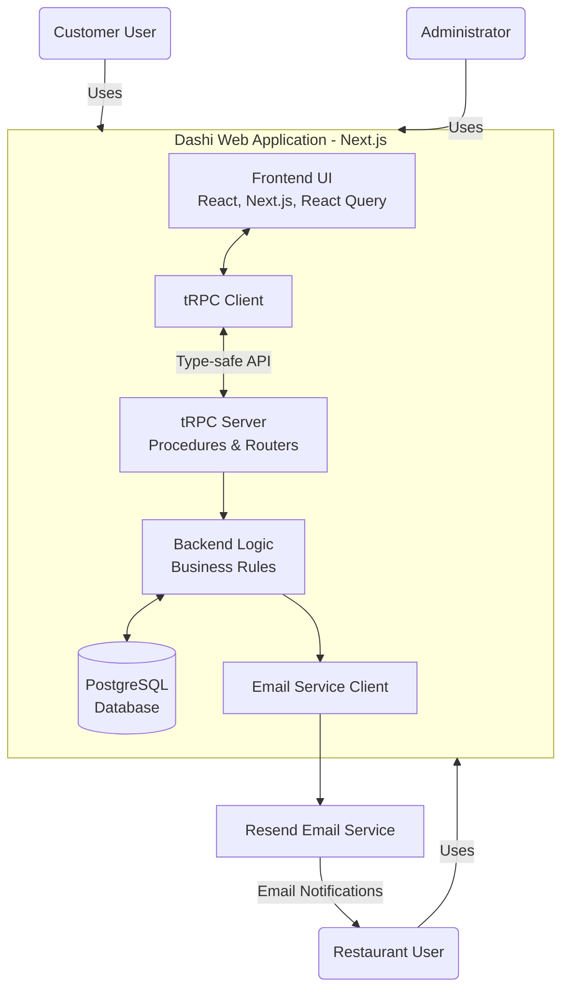
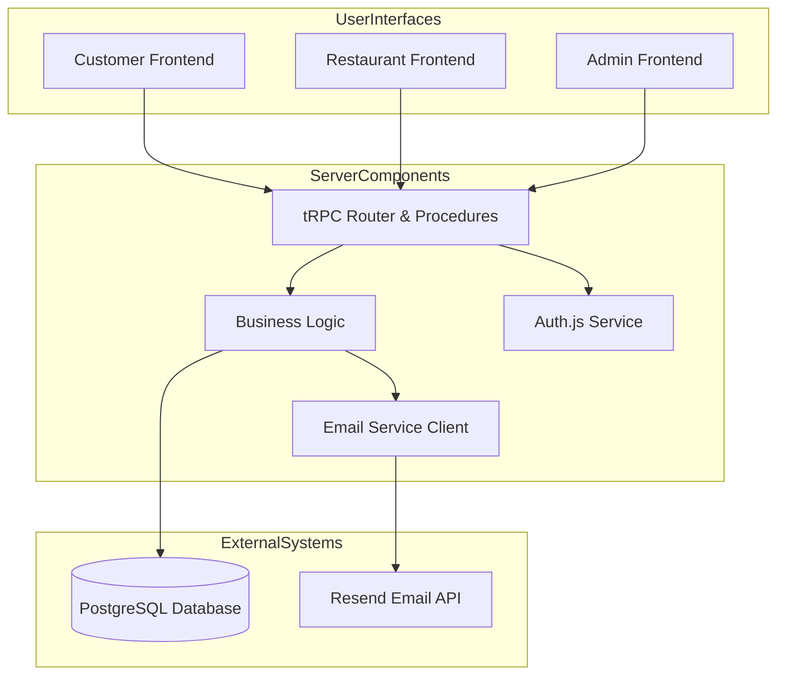

# Dashi Architecture Document

## Status: Draft

## Technical Summary

The Dashi MVP will be built as a server-rendered web application using the **Next.js App Router** framework. This choice provides a unified development environment for both frontend (React) and backend logic. Data will be stored in a **PostgreSQL** database, chosen for its reliability and structured data capabilities, managed via the **Prisma ORM** for type safety and streamlined database interactions. The user interface will leverage **Shadcn UI** components for a consistent and modern look and feel, following a DoorDash-like aesthetic. Authentication will be handled using **Auth.js** (formerly NextAuth.js) for secure email/password login. End-to-end type safety between the frontend and backend API will be achieved using **tRPC**, integrated with **React Query** for data fetching and caching, and **Zod** for schema validation. Transactional emails, specifically for order notifications, will be sent via the **Resend** email service. The application will be hosted on **Vercel**, benefiting from its optimized hosting for Next.js applications and integrated Git-based deployment. Testing will be implemented using **Jest** and **React Testing Library**.

## Technology Table

| Technology            | Version       | Description                                                                                        |
| --------------------- | ------------- | -------------------------------------------------------------------------------------------------- |
| Next.js               | Latest        | React framework for building the user interface and API routes. App Router is used.                |
| React                 | Latest        | Frontend UI library.                                                                               |
| Shadcn UI             | Latest        | Re-usable UI components based on Radix UI and Tailwind CSS.                                        |
| Tailwind CSS          | Latest        | Utility-first CSS framework for styling.                                                           |
| PostgreSQL            | Latest Stable | Relational database for structured data storage.                                                   |
| Prisma                | Latest        | Database toolkit for schema modeling, migrations, and querying (ORM/Query Builder).                |
| Vercel                | N/A           | Platform for hosting Next.js applications and serverless functions.                                |
| Auth.js (NextAuth.js) | Latest        | Authentication library for handling user login, registration, and sessions.                        |
| tRPC                  | Latest        | End-to-end typesafe API layer.                                                                     |
| React Query           | Latest        | Hooks for fetching, caching and updating asynchronous data in React, integrates with tRPC.         |
| Zod                   | Latest        | TypeScript-first schema declaration and validation library. Used for tRPC input/output validation. |
| Resend                | Latest API    | Transactional email sending service for order notifications.                                       |
| Jest                  | Latest        | JavaScript testing framework (unit tests, API tests).                                              |
| React Testing Library | Latest        | Testing library for testing React components from a user perspective.                              |
| react-i18next         | Latest        | Internationalization framework for managing translation strings.                                   |

## High-Level Overview

The Dashi MVP adopts a **Monolithic** architectural style, specifically a **Modular Monolith** built within the Next.js App Router structure. The interaction between the frontend and backend logic will be facilitated by **tRPC**, providing a type-safe API layer over HTTP.

**Justification:** For an MVP focused on rapid development and validating core functionality with a small team and limited initial scale, a monolithic architecture within a framework like Next.js is highly efficient. It simplifies deployment, reduces operational overhead compared to microservices, and allows for tight coupling between frontend and backend code where beneficial. The App Router's structure facilitates logical separation into modules (customer, restaurant, admin, auth, API) providing some modularity benefits within the monolith. The integration of tRPC enhances developer experience and reduces bugs through type safety, improving overall development velocity after the initial setup. While the PRD mentions scalability for the future, this initial phase does not require distributed systems complexity.



## Component View

The application can be broken down into the following key logical components/modules:



1. **Customer Frontend:**

   - **Responsibility:** Handles public-facing user interactions for Browse restaurants and menus, adding items to the cart, checkout, registration, login, and viewing order history.
   - **Technologies:** React, Next.js (App Router), Shadcn UI, Tailwind CSS, react-i18next, React Query, tRPC client.
   - **Interactions:** Communicates with the Backend via **tRPC procedures** to fetch data (restaurants, menus, orders) and send actions (register, login, place order). Leverages React Query for efficient data management and caching.

2. **Restaurant Frontend:**

   - **Responsibility:** Provides the dashboard interface for restaurant users to view incoming orders, update order statuses, and manage their menu items.
   - **Technologies:** React, Next.js (App Router), Shadcn UI, Tailwind CSS, react-i18next, React Query, tRPC client.
   - **Interactions:** Communicates with the Backend via **tRPC procedures** to fetch restaurant-specific data (orders, menu) and send actions (update order status, add/edit/delete menu item). Requires authenticated `Restaurant` user session, enforced by tRPC and Auth.js. Implements simple polling via React Query for new orders.

3. **Admin Frontend:**

   - **Responsibility:** Provides the dashboard interface for administrators to manage restaurant profiles and view basic sales data.
   - **Technologies:** React, Next.js (App Router), Shadcn UI, Tailwind CSS, react-i18next, React Query, tRPC client.
   - **Interactions:** Communicates with the Backend via **tRPC procedures** to manage restaurant data (add/edit/list restaurants) and fetch sales reports. Requires authenticated `Admin` user session, enforced by tRPC and Auth.js.

4. **Backend (Next.js API Routes + tRPC):**

   - **Responsibility:** Acts as the central server-side logic layer. Hosts the tRPC router and procedures. Handles incoming tRPC requests, performs data validation (using Zod), interacts with the database, implements business logic (e.g., calculating order totals, triggering notifications), and enforces authentication/authorization using Auth.js session context within tRPC.
   - **Technologies:** Next.js (App Router API Routes), Node.js, Prisma ORM, Auth.js, tRPC server, Zod, Resend SDK.
   - **Interactions:**
     - Receives HTTP requests tunnelled via a single tRPC API route.
     - Processes requests via the tRPC router and executes relevant procedures.
     - Interacts with the **PostgreSQL Database** via Prisma for CRUD operations.
     - Uses **Auth.js** session context within tRPC procedures for authentication/authorization checks.
     - Calls the **Resend Email Service** API to send order notification emails.
     - Manages user roles and permissions based on Auth.js session.

5. **PostgreSQL Database:**

   - **Responsibility:** Persistently stores all application data, including users, restaurants, menu items, orders, order items, etc.
   - **Technology:** PostgreSQL.
   - **Interactions:** Accessed exclusively by the **Backend** via the Prisma ORM.

6. **Resend Email Service:**
   - **Responsibility:** External third-party service responsible for sending transactional emails (order notifications) reliably.
   - **Technology:** Resend API.
   - **Interactions:** Called by the **Backend (tRPC procedures)** via the Resend SDK/API client.

## Key Architectural Decisions & Patterns

- **Monolithic Architecture:** Chosen for rapid development, simplified deployment, and reduced operational overhead for the MVP phase.

- **Type-Safe API Layer with tRPC:**

  - **Decision:** Use tRPC instead of traditional REST API endpoints.
  - **Justification:** Provides end-to-end type safety between frontend and backend, reducing bugs and increasing development velocity after initial setup.

- **Service/Repository Pattern:**

  - **Decision:** Abstract database interactions and business logic into service functions.
  - **Justification:** Improves code organization, testability, and maintainability.

- **Database Schema with Soft Deletes:**

  - **Decision:** Implement soft delete for `MenuItem` and `Restaurant` entities.
  - **Justification:** Preserves data integrity and history, especially for orders referencing deleted items.

- **Authentication with Auth.js:**

  - **Decision:** Use Auth.js (formerly NextAuth.js) for authentication.
  - **Justification:** Well-integrated with Next.js, provides session management, and supports multiple auth providers.

- **Email Notifications via Resend:**

  - **Decision:** Use Resend for transactional emails.
  - **Justification:** Modern, developer-friendly API with good deliverability.

- **Simple Polling for Order Updates:**

  - **Decision:** Use React Query's polling capabilities for checking new orders.
  - **Justification:** Simpler implementation than WebSockets or SSE for MVP, with acceptable UX for the initial version.

- **Multi-language Support:**
  - **Decision:** Use Next.js built-in i18n routing with react-i18next.
  - **Justification:** Well-supported, efficient solution for the MVP's requirement to support English and French.

## Infrastructure and Deployment Overview

- **Cloud Provider:** Vercel (for hosting Next.js application)
- **Database:** Managed PostgreSQL instance (e.g., Railway, Supabase, or similar)
- **Email Service:** Resend
- **Deployment Strategy:** Vercel's integrated Git-based deployment with automated preview environments
  - Runs tests before deployment
  - Database migrations handled via Prisma (`prisma migrate deploy`)
- **Environments:**
  - Development (local)
  - Staging (preview deployments for PRs)
  - Production

## Project Structure (Next.js App Router with tRPC)

The project follows a well-defined structure to organize code following the Next.js App Router conventions while incorporating tRPC for API interactions. This structure ensures clear separation of concerns and maintains consistency across the codebase.

```
├── /app                          # Next.js App Router directory
│   ├── /(customer)               # Group customer-facing routes (non-segment)
│   │   ├── /restaurants
│   │   │   ├── /[slug]           # Dynamic route for restaurant menu
│   │   │   │   ├── page.tsx      # Menu page component
│   │   │   │   └── loading.tsx   # Loading state (optional)
│   │   │   └── page.tsx          # Restaurants listing page
│   │   ├── /cart
│   │   │   └── page.tsx          # Cart page
│   │   ├── /checkout
│   │   │   └── page.tsx          # Checkout page
│   │   ├── /order-history
│   │   │   └── page.tsx          # Customer order history page
│   │   ├── /login
│   │   │   └── page.tsx          # Customer login page
│   │   ├── /register
│   │   │   └── page.tsx          # Customer registration page
│   │   └── layout.tsx            # Customer layout (e.g., includes header with cart/login)
│   ├── /(auth)                   # Authentication routes/components (non-segment)
│   │   └── /api/auth             # Auth.js API routes
│   │       └── [...nextauth]     # Catch-all route for Auth.js
│   ├── /(admin)                  # Group admin-facing routes (non-segment)
│   │   └── /dashboard
│   │       ├── /restaurants      # Admin restaurant management pages
│   │       │   ├── /new          # Admin add new restaurant page
│   │       │   ├── /[id]/edit    # Admin edit restaurant page
│   │       │   └── page.tsx      # Admin restaurant list page
│   │       └── /sales            # Admin sales tracking page
│   │       └── layout.tsx        # Admin layout
│   ├── /(restaurant)             # Group restaurant-facing routes (non-segment)
│   │   └── /dashboard
│   │       ├── /orders           # Restaurant order list/details pages
│   │       │   ├── /[id]         # Restaurant single order details page
│   │       │   └── page.tsx      # Restaurant order list page
│   │       ├── /menu             # Restaurant menu management pages
│   │       │   ├── /new          # Restaurant add new menu item page
│   │       │   ├── /[id]/edit    # Restaurant edit menu item page
│   │       │   └── page.tsx      # Restaurant menu list page
│   │       └── layout.tsx        # Restaurant layout
│   ├── /api                      # Next.js API routes (only one for tRPC)
│   │   └── trpc                  # tRPC API route
│   │       └── [...trpc]         # Catch-all route for tRPC requests
│   │           └── route.ts      # The actual tRPC API handler
│   ├── /components               # Reusable React components
│   │   ├── /ui                   # Shadcn UI components (as generated by shadcn CLI)
│   │   ├── /custom               # Other custom components (e.g., CartIcon, LanguageSwitcher)
│   │   └── /layout               # Layout components (e.g., Header, Footer)
│   ├── /lib                      # Backend logic, database interactions, helpers, constants
│   │   ├── /auth.ts              # Auth.js configuration and helpers
│   │   ├── /db.ts                # Prisma client instance
│   │   ├── /utils.ts             # General utility functions
│   │   └── /mail.ts              # Email sending logic using Resend
│   ├── /server                   # Backend specific code (tRPC router, procedures, context)
│   │   ├── /trpc                 # tRPC setup
│   │   │   ├── /trpc.ts          # tRPC initializers (router, context)
│   │   │   ├── /routers          # Define tRPC routers (public, customer, restaurant, admin)
│   │   │   │   ├── _app.ts       # Combines all routers
│   │   │   │   ├── public.ts
│   │   │   │   ├── customer.ts
│   │   │   │   ├── restaurant.ts
│   │   │   │   └── admin.ts
│   │   │   └── /middleware.ts    # Custom tRPC middlewares (auth, role checks)
│   ├── /trpc                     # Frontend tRPC client setup and type definitions
│   │   ├── /client.ts            # tRPC client setup for frontend
│   │   └── /serverClient.ts      # Optional: tRPC client for use in Server Components
│   ├── /hooks                    # Custom React hooks (e.g., useCart, useAuth, hooks generated by tRPC)
│   ├── /contexts                 # React Contexts (e.g., CartContext, LanguageContext, tRPCProvider)
│   ├── layouts.tsx               # Root layout
│   ├── global.css                # Global styles (via Tailwind)
│   └── page.tsx                  # Root homepage (could redirect or be the customer homepage)
├── /prisma                       # Prisma schema and migrations files
├── /public                       # Static assets (images, fonts, favicon)
├── /emails                       # Directory for storing React email templates (optional, if using)
├── .env.local                    # Local environment variables
├── next.config.js                # Next.js configuration
├── postcss.config.js             # PostCSS configuration (for Tailwind)
├── tailwind.config.js            # Tailwind CSS configuration
├── tsconfig.json                 # TypeScript configuration
├── jest.config.js                # Jest configuration
├── setupTests.ts                 # Testing setup file (e.g., for React Testing Library imports)
└── README.md                     # Project README
```

### Key Organizational Principles

1. **Route Groups**: Using Next.js App Router's route groups (parentheses notation) to organize routes by user type without affecting the URL structure.
2. **Component Organization**: UI components are separated into categories (ui, custom, layout) based on their purpose and reusability.
3. **Server-Side Organization**: Clear separation of backend logic (server directory) from frontend code.
4. **API Structure**: Centralized tRPC API endpoint with logically separated routers based on user roles.
5. **Type Safety**: End-to-end type safety using tRPC, with client setup available for both client and server components.

This structure is designed to:

- Scale efficiently as the application grows
- Maintain clear boundaries between different user types
- Follow the Next.js 13+ App Router conventions
- Support internationalization requirements
- Facilitate easy navigation for developers

## Key Reference Documents

- docs/prd.md - Product Requirements Document
- docs/testing-strategy.md - Testing approach and standards
- docs/ui-ux-spec.md - User interface and experience specifications
- docs/coding-standards.md - Code style and patterns
- docs/data-models.md - Database schema and relationships

## Change Log

| Change           | Date       | Version | Description                                      | Author         |
| ---------------- | ---------- | ------- | ------------------------------------------------ | -------------- |
| Initial draft    | 2025-05-05 | 0.1     | Initial architecture document based on Dashi PRD | GitHub Copilot |
| tRPC Integration | 2025-05-05 | 0.2     | Added tRPC for API layer, updated component view | GitHub Copilot |

<!-- Generated by Copilot -->
